.. _xappoai:

==============================
Session 1 - Setup Requirements
==============================

System Requirements
--------------------

* Operating System: Ubuntu 24.04 LTS (x86, 64-bit)

    * ARM devices such as MacBook M1 (Apple silicon) are unsupported!

* CPU: At least 8 cores

    * We will be running the base station and the user on one system, so ideally more cores is better.

* RAM: 32GB

Install Dependencies
--------------------

.. code-block:: bash

	sudo apt install git vim tree net-tools libsctp-dev python3.8 cmake-curses-gui libpcre2-dev python-dev build-essential cmake libfftw3-dev libmbedtls-dev libboost-program-options-dev libconfig++-dev libtool autoconf python3-pip curl bison flex iperf unzip

Install Swig 4.1
~~~~~~~~~~~~~~~~

.. code-block:: bash

	git clone https://github.com/swig/swig.git
	cd swig
	git checkout release-4.1
	./autogen.sh
	./configure --prefix=/usr/
	make -j8
	sudo make install

Check GCC Version (gcc-10, gcc-12, or gcc-13)
~~~~~~~~~~~~~~~~~~~~~~~~~~~~~~~~~~~~~~~~~~~~~

.. code-block:: bash

	gcc --version

.. warning::

    If you see that you have gcc 11, follow the steps given `here <https://linuxconfig.org/how-to-switch-between-multiple-gcc-and-g-compiler-versions-on-ubuntu-20-04-lts-focal-fossa>`_ to switch to a different version

Install Docker Compose
~~~~~~~~~~~~~~~~~~~~~~

.. code-block:: bash

	sudo apt install -y putty ca-certificates gnupg
	sudo install -m 0755 -d /etc/apt/keyrings
	curl -fsSL https://download.docker.com/linux/ubuntu/gpg | sudo gpg --dearmor -o /etc/apt/keyrings/docker.gpg
	sudo chmod a+r /etc/apt/keyrings/docker.gpg
	echo "deb [arch="$(dpkg --print-architecture)" signed-by=/etc/apt/keyrings/docker.gpg] https://download.docker.com/linux/ubuntu "$(. /etc/os-release && echo "$VERSION_CODENAME")" stable" | sudo tee /etc/apt/sources.list.d/docker.list > /dev/null
	sudo apt-get update
	sudo apt install -y docker-buildx-plugin docker-compose-plugin

Check docker compose version. The installed version should be ``v2.29``.

.. code-block:: bash

	sudo docker compose version

.. note::

	Optional Step: If you do not want to use sudo while executing docker compose commands, run ``sudo usermod -a -G docker $(whoami)`` and ``reboot`` the machine.

============================
Session 2 - OAI Installation
============================

Background
==========

Refer to the presentation (PIMRC slides 5-10)

* 1G-5G timeline

* Reference Cellular Architecture (RAN)

* Evolution of RAN (vRAN and O-RAN)

What is Open RAN?
~~~~~~~~~~~~~~~~~

Open RAN (Radio Access Network) is a virtualized, disaggregated design paradigm for 5G/6G cellular networks.
It refers to the concept of a cellular network that is built on open interfaces and modular components.

Open RAN is important because it...

* enables networks built from components by multiple vendors, replacing the current proprietary systems belonging to each vendor and mobile carrier

* allows vendors to share physical and cloud resources in the same cell tower

* is desirable as an industry standard; for example, the U.S. has awarded over $100M to Open RAN projects this year.

What is O-RAN?
~~~~~~~~~~~~~~

O-RAN is Open RAN as defined by O-RAN ALLIANCE, which is a worldwide community of mobile network operators, vendors, and research & academic institutions.
"`O-RAN ALLIANCE's mission <https://www.o-ran.org/about>` is to re-shape the RAN industry towards more intelligent, open, virtualized and fully interoperable mobile networks."

What is OAI?
~~~~~~~~~~~~

Thare are various open-source software solutions built upon the 5G and O-RAN standards.
The one we will use in this training is OpenAirInterface or OAI, which is a software stack providing the components needed for an operational
radio access network purely implemented in software.

The major components are:

* The 5G core network

* The gNB / gNodeB / base station (BS)

    * In O-RAN, the gNB can be split between the Centralized Unit (CU) and the Distributed Unit (DU),
    where the CU contains the higher-level layers of the network protocol stack and the DU contains the lower layers.

* The user equipment (UE)

Setup
=====

.. _Setup_CN:

Setup OAI 5G Core Network
-------------------------

In this demo, we will employ the Core Network solution provided by Open Air Interface. This solution deploys network functions as docker containers. The CN components can be customized according to experimental requirements by modifying the configuration files. However, for the purposes of this tutorial we retain the default functionality.

Get Core Network Configuration files and docker images
~~~~~~~~~~~~~~~~~~~~~~~~~~~~~~~~~~~~~~~~~~~~~~~~~~~~~~

.. code-block:: bash

	cd
	wget -O ~/oai-cn5g.zip https://gitlab.eurecom.fr/oai/openairinterface5g/-/archive/develop/openairinterface5g-develop.zip?path=doc/tutorial_resources/oai-cn5g
	unzip ~/oai-cn5g.zip
	mv ~/openairinterface5g-develop-doc-tutorial_resources-oai-cn5g/doc/tutorial_resources/oai-cn5g ~/oai-cn5g
	rm -r ~/openairinterface5g-develop-doc-tutorial_resources-oai-cn5g ~/oai-cn5g.zip
	cd ~/oai-cn5g
	sudo docker compose pull

Test the deployment of Core Network
~~~~~~~~~~~~~~~~~~~~~~~~~~~~~~~~~~~

.. code-block:: bash

	sudo docker compose up -d

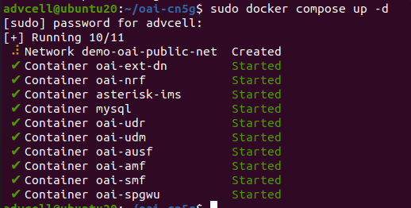

Verify that all the 10 containers are deployed and ``healthy``.

.. code-block:: bash

	sudo docker ps -a

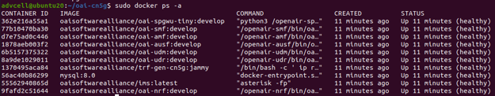

Turn the core network off.

.. code-block:: bash

	sudo docker compose down

If you prefer seeing real-time container logs streaming to your terminal, run the docker compose command without the -d flag.
In that mode, pressing Ctrl+C will stop all containers!

.. _Setup_RAN:

Setup OAI Radio Access Network and UE
-------------------------------------

Clone the OAI 5G RAN repository from GitLab, and check out the `develop` branch.

.. code-block:: bash

	git clone https://gitlab.eurecom.fr/oai/openairinterface5g.git ~/oai
	cd ~/oai
	git checkout develop

Install OAI dependencies:

.. code-block:: bash

	cd ~/oai/cmake_targets/
	sudo ./build_oai -I -w SIMU --gNB --nrUE --build-e2 --ninja

This installs a couple important packages required by OAI gNB and UE, including libsctp-dev, libtool, SIMDE and most importantly, ASN.1.
The installation logs are not displayed on your terminal, it will be written to file in your log directory, double check to ensure ASN.1 was installed properly.
See parts of the logs for this step below:

Install nrscope dependencies: 

.. code-block:: bash

    sudo apt install -y libforms-dev libforms-bin

Next, we can build the binaries for the OAI base station (gNB) and the OAI user (UE).

.. code-block:: bash

    cd ~/openairinterface5g/cmake_targets 
    sudo ./build_oai -w SIMU --ninja --nrUE --gNB --build-lib "nrscope" -C 

In a real world system, the core, gNB, and UE would be located on separate systems, but for simplicity we will run everything
together on one system.

Note that we compile with the `-w SIMU` option which means that we want to use a simulated radio instead of a physical radio
such as a USRP software-defined radio. For a USRP we would change this to `-w USRP`.

======================================
Session 3 - Using RFSimulator with OAI
======================================

5G CN, gNodeB, OAI open-source overview 

How it works end to end with a RF Simulated OAI-gNodeB and OAI NR-UE 

Deploy 5G Network
-----------------

Start the Core Network
~~~~~~~~~~~~~~~~~~~~~~
In Terminal 1,

.. code-block:: bash

	cd ~/oai-cn5g
	sudo docker compose up -d
	cd ~/

Check if the Core Network is up and running

.. code-block:: bash

	sudo docker ps -a

Start the gNB
~~~~~~~~~~~~~

In ``Terminal 1``,

.. code-block:: bash

	cd ~/oai/cmake_targets/ran_build/build
	sudo ./nr-softmodem -O ../../../targets/PROJECTS/GENERIC-NR-5GC/CONF/gnb.sa.band78.fr1.106PRB.usrpb210.conf --gNBs.[0].min_rxtxtime 6 --rfsim --sa

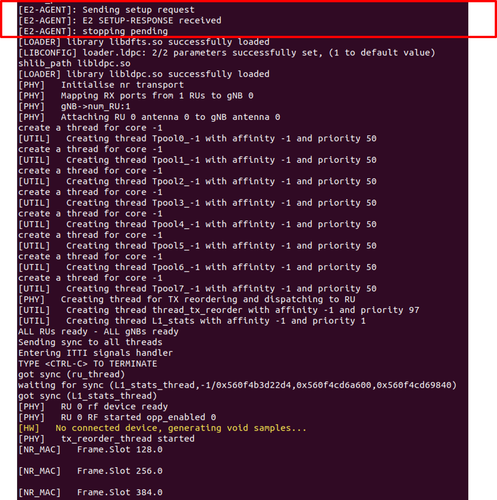

Start the UE
~~~~~~~~~~~~

In ``terminal 2``,

.. code-block:: bash

	cd ~/oai/cmake_targets/ran_build/build
	sudo ./nr-uesoftmodem -r 106 --numerology 1 --band 78 -C 3619200000 --rfsim --sa --uicc0.imsi 001010000000001 --rfsimulator.serveraddr 127.0.0.1

How to perform traffic tests 

.. _exch_trf:

Exchange traffic between Network and UE
---------------------------------------

Streaming Traffic using Ping
~~~~~~~~~~~~~~~~~~~~~~~~~~~~

For uplink ping - UE to network

In ``terminal 4``,

.. code-block:: bash

	ping 192.168.70.135 -I oaitun_ue1

For Downlink ping - Network to UE

.. code-block:: bash

	sudo docker exec -it oai-ext-dn ping <ue_ip>

Use ``ctrl+c`` or ``ctrl+d`` to stop/exit the ping processes.

Streaming Traffic with iPerf
~~~~~~~~~~~~~~~~~~~~~~~~~~~~

Downlink iPerf

Find out the IP address of the UE by running ``ifconfig`` on the UE machine and check the IP address field of ``oaitun_ue1`` network Interface. Here we initialize an iperf server for UDP traffic.

In ``terminal 4``,

.. code-block:: bash

	iperf -s -u -i 1 -B <ue_ip>

The below command generates UDP traffic for 100 seconds, at the rate of 10Mbps from the Core network. In terminal 5,

.. code-block:: bash

	sudo docker exec -it oai-ext-dn iperf -u -t 100 -i 1 -fk -B 192.168.70.135 -b 10M -c <ue_ip>

Uplink iperf

On ``terminal 4``, initialize the iperf server (metrics are printed every second) for TCP traffic run,

.. code-block:: bash

	sudo docker exec -it oai-ext-dn iperf -s -i 1 -fk -B 192.168.70.135

In ``terminal 5``, run

.. code-block:: bash

	iperf -c 192.168.70.135 -i 1 -b 10M -B <ue_ip>

============================
Session 4 - OAI Installation
============================

What is O-RAN?
~~~~~~~~~~~~~~

O-RAN is the Open RAN as defined by O-RAN ALLIANCE, which is a worldwide community of mobile network operators, vendors, and research & academic institutions.
"`O-RAN ALLIANCE's mission <https://www.o-ran.org/about>` is to re-shape the RAN industry towards more intelligent, open, virtualized and fully interoperable mobile networks."

* Founded by AT&T, China Mobile, Deutsche Telekom, NTT DOCOMO and Orange in Feb 2018

* Based on two core principles: Openness, Intelligence

* Flexibility by design

    * Open interfaces and APIs

* RAN Intelligent Controllers (RICs)

    * Abstract the networks

    * Allow telecom operators to implement custom control logic

For more information, refer to the presentation (PIMRC slides 5-39)

.. _Setup_RAN_E2:

Setup OAI Radio Access Network and UE
-------------------------------------

Clone the OAI 5G RAN repository and checkout the ``oaic_workshop_2024_v1`` branch.

.. code-block:: bash

	git clone https://github.com/openaicellular/openairinterface5G.git ~/oai
	cd ~/oai
	git checkout oaic_workshop_2024_v1
	cd ~/oai/cmake_targets/
	./build_oai -I -w SIMU --gNB --nrUE --build-e2 --ninja

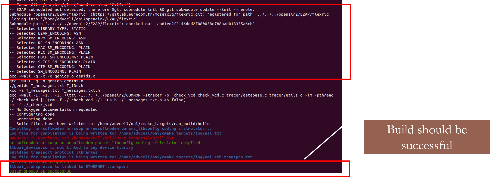

============================
Session 5 - FlexRIC Installation
============================

.. _Setup_FlexRIC:

Setup FlexRIC
-------------

Clone the OAI 5G RAN repository and checkout the ``beabdd07`` commit.

.. code-block:: bash

	git clone https://github.com/openaicellular/flexric.git ~/flexric
	cd ~/flexric
	git checkout beabdd07

Build the flexRIC module.

.. code-block:: bash

	mkdir build
	cd build
	cmake ../

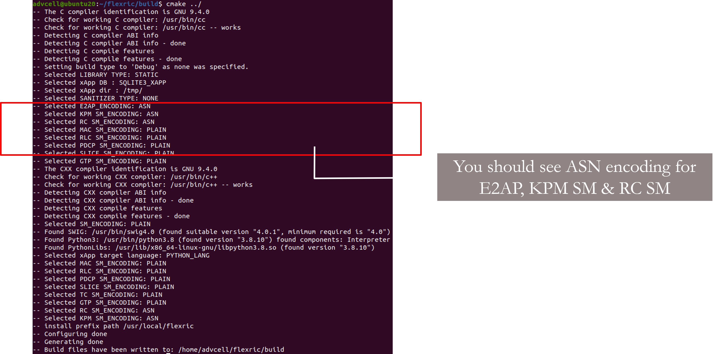

.. code-block:: bash

	make -j`nproc`
	sudo make install

.. image:: flexric_make_inst.png
   :width: 60%
   :alt: Tmux cheatsheet

.. _Run_nw_E2:

Deploy 5G Network
-----------------

Start the Core Network
~~~~~~~~~~~~~~~~~~~~~~
In Terminal 1,

.. code-block:: bash

	cd ~/oai-cn5g
	sudo docker compose up -d
	cd ~/

Check if the Core Network is up and running

.. code-block:: bash

	sudo docker ps -a

Start the gNB
~~~~~~~~~~~~~

In ``Terminal 1``,

.. code-block:: bash

	cd ~/oai/cmake_targets/ran_build/build
	sudo ./nr-softmodem -O ../../../targets/PROJECTS/GENERIC-NR-5GC/CONF/gnb.sa.band78.fr1.106PRB.usrpb210.conf --gNBs.[0].min_rxtxtime 6 --rfsim --sa

Start the UE
~~~~~~~~~~~~

In ``terminal 2``,

.. code-block:: bash

	cd ~/oai/cmake_targets/ran_build/build
	sudo ./nr-uesoftmodem -r 106 --numerology 1 --band 78 -C 3619200000 --rfsim --sa --uicc0.imsi 001010000000001 --rfsimulator.serveraddr 127.0.0.1

Start the near-RT RIC
~~~~~~~~~~~~~~~~~~~~~

In ``terminal 3``,

.. code-block:: bash

	cd ~/
	./flexric/build/examples/ric/nearRT-RIC

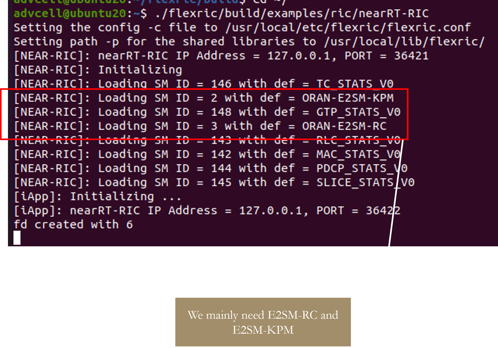

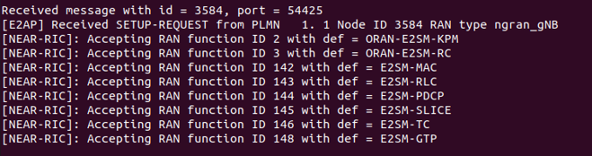

.. _exch_trf:

Exchange traffic between Network and UE
---------------------------------------

Streaming Traffic with iPerf
~~~~~~~~~~~~~~~~~~~~~~~~~~~~

Uplink iperf

On ``terminal 4``, initialize the iperf server (metrics are printed every second) for TCP traffic run,

.. code-block:: bash

	sudo docker exec -it oai-ext-dn iperf -s -i 1 -fk -B 192.168.70.135

In ``terminal 5``, run

.. code-block:: bash

	iperf -c 192.168.70.135 -i 1 -b 10M -B <ue_ip>

=======================================
Session 6 - xApp onboarding, deployment
=======================================

Background
----------

An xApp is simply an application that is deployed to the **near-real-time** RAN Intelligent Controller (RIC) and is capable of communicating to the RAN.
An xApp can be developed in any programming language, but to be O-RAN compliant, it needs to be able to communicate over the E2 interface to E2 nodes.
An E2 Node refers to a component of the RAN that can interface with the RIC via E2, usually referring to the base station (DU/CU).
Note that the user has no direct connection to the E2 interface; when we refer to the RAN in this context, we generally mean the base station.

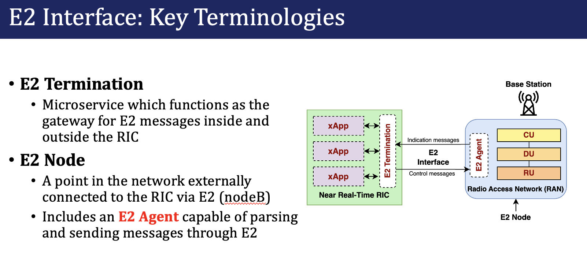

There is also a **non-real-time** RIC; applications stored in the non-real-time RIC are called rApps instead.
Near-real-time applications are defined as running within 10ms to 1 second, while a non-real-time application takes longer than 1 second.

Below is a comparison between xApps and rApps:

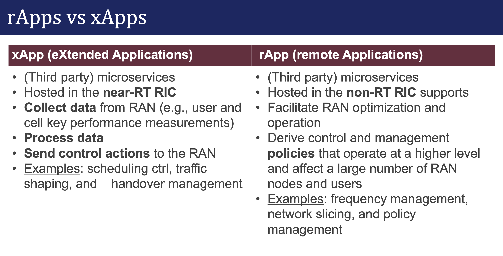

What problems in 5G networks can xApps can solve?
~~~~~~~~~~~~~~~~~~~~~~~~~~~~~~~~~~~~~~~~~~~~~~~~~

* Spectrum sharing - Ensuring multiple networks on the same frequency do not interfere with each other

    * Interference detection and mitigation - `detecting interference through performance metrics or spectrograms <https://ieeexplore.ieee.org/document/10356330>`_ and moving communications away from interfered frequencies
    * Radar detection - in order to avoid interference between radar and 5G networks, see `SenseORAN <https://ieeexplore.ieee.org/document/10353027>`_

* Anomaly detection - identifying users in the network which maliciously disrupt the RAN or other xApps from working properly

* Traffic steering - looking at user behavior and connecting them to different cells in the RAN for load balancing or energy saving

How do xApps work in the RIC?
~~~~~~~~~~~~~~~~~~~~~~~~~~~~~

To understand how an xApp works, first we must look at how an O-RAN network is implemented.
The RAN Intelligent Controller (RIC) is capable of dynamically controlling the RAN.
The near-RT RIC that we will use with OAI is called FlexRIC.

FlexRIC consists of a collection of microservices, which are small containerized programs.
These containers are created and deployed using Docker, using an image that we prepare beforehand that consists of everything needed
for the application to start instantly. FlexRIC acts as a message broker between xApps and E2 nodes by providing the `E2 termination`,
the point at which all the xApps and E2 nodes connect to communicate with each other.
The xApps we will use are hosted on a `single` Docker container, but several microservices could make up a single xApp.

The E2 interface is based on the O-RAN ALLIANCE's specifications.
Messages are encoded through the ASN.1 standard, which allows messages to be encoded in binary according to a specification file.
ASN.1 encoding and decoding is implemented for many programming languages, allowing E2 and xApp specifications to be theoretically language-agnostic.

xApps can define the contents of the data that they send and receive by writing an ASN.1 specification.
We refer to an xApp's message specification as a `service model`.

Below is an excerpt of example ASN.1 syntax:

.. code-block:: rst

    Metrics ::= SEQUENCE {
        MCS INTEGER (0.. 28, ...) OPTIONAL,
        bitrateMbps INTEGER (0.. 65535, ...) OPTIONAL,
        ...
    }

    DownlinkMetrics ::= SEQUENCE {
        CQI INTEGER (0.. 15, ...) OPTIONAL,
        metrics Metrics,
        ...
    }

    IndicationMessage ::= SEQUENCE {
        Payload DownlinkMetrics
    }

The O-RAN specifications are available on the O-RAN ALLIANCE's website: https://specifications.o-ran.org/specifications
Some examples of E2 service models which are standardized by the O-RAN ALLIANCE include:

* E2SM-KPM, which allows the RAN to send key performance metrics to an xApp,
such as the bitrate and error rate for each user

* E2SM Cell Configuration and Control, which allows an xApp to control the RAN at the node and cell levels

* E2SM RAN control, which allows an xApp to control the RAN at the UE and cell levels

xApps are persistent in the RIC and run continuously. Since the RIC can be connected to multiple RANs,
xApps wait for base stations to connect. When connecting to the RIC, the RAN must subscribe to any xApps that it wants to communicate with.

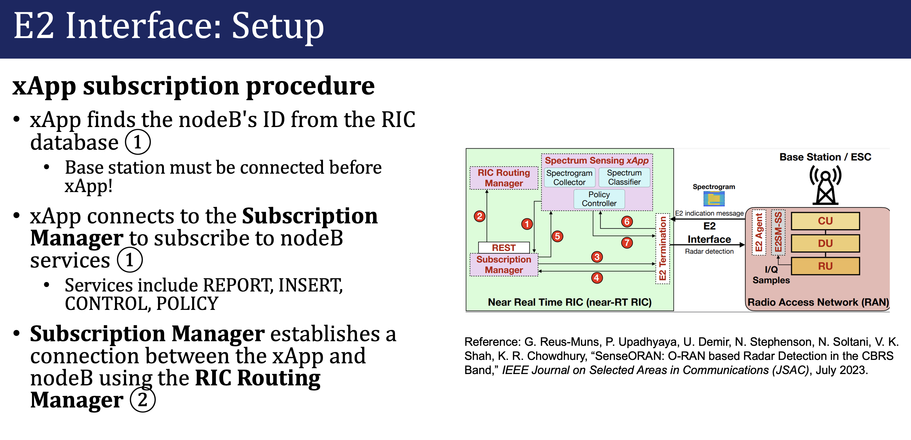

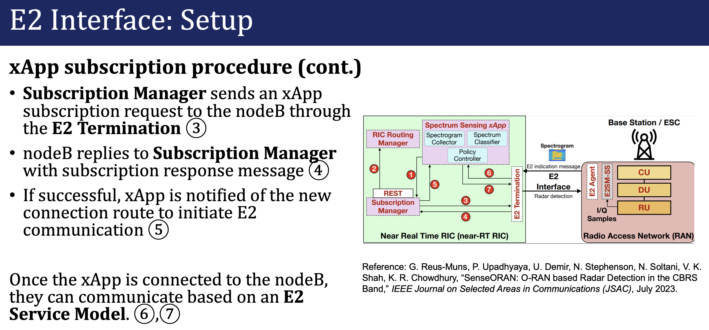

.. _run_xapp:

Run xApps
---------

KPIMON xApp
~~~~~~~~~~~

First we will run the KPIMON xApp and observe some metrics. This xApp is based on the ``E2SM-KPM (Key Performance Metrics)`` service model. It is responsible for collecting metrics collected by the RAN and forwarding it to relevant xApps to help in RAN control.
The KPM service model sends data from the RAN to the RIC, which we call an indication message.
When we want the RIC to control the RAN, we must send a control message from the xApp, but in this case, we only receive indication messages.

Per O-RAN specifications, 5G measurements supported by KPM are specified in **3GPP TS 28.552**. Some of the metrics supported are ``DRB.PdcpSduVolumeDL``, ``DRB.PdcpSduVolumeUL``, ``DRB.RlcSduDelayDl``, ``DRB.UEThpDl``, ``DRB.UEThpUl``, ``RRU.PrbTotDl``, ``RRU.PrbTotUl``.
In this implementation **Report Style 4 (Section 7.4.5)** has been considered.

In a new Terminal, run

.. code-block:: bash

	cd ~/flexric
	./build/examples/xApp/c/monitor/xapp_kpm_moni

The output should look like this:

Behind the scenes
~~~~~~~~~~~~~~~~~~

FlexRIC supports writing xApps in C or Python.

Writing an xApp in C is fairly simple. Looking at the KPIMON xApp:

.. code-block:: c

    int main(int argc, char *argv[])
    {
        fr_args_t args = init_fr_args(argc, argv);

        //Init the xApp
        init_xapp_api(&args);
        sleep(1);

        e2_node_arr_t nodes = e2_nodes_xapp_api();
        defer({ free_e2_node_arr(&nodes); });

        assert(nodes.len > 0);

        printf("Connected E2 nodes = %d\n", nodes.len);

.. code-block:: c

    // KPM indication
    sm_ans_xapp_t* kpm_handle = NULL;
    if(nodes.len > 0){
        kpm_handle = calloc( nodes.len, sizeof(sm_ans_xapp_t) ); 
        assert(kpm_handle  != NULL);
    }

    for (int i = 0; i < nodes.len; i++) {
        e2_node_connected_t* n = &nodes.n[i];
        for (size_t j = 0; j < n->len_rf; j++)
        printf("Registered node %d ran func id = %d \n ", i, n->ack_rf[j].id);

        ////////////
        // START KPM
        ////////////
        kpm_sub_data_t kpm_sub = {0};
        defer({ free_kpm_sub_data(&kpm_sub); });

        // KPM Event Trigger
        uint64_t period_ms = 1000;
        kpm_sub.ev_trg_def = gen_ev_trig(period_ms);
        printf("[xApp]: reporting period = %lu [ms]\n", period_ms);

        // KPM Action Definition
        kpm_sub.sz_ad = 1;
        kpm_sub.ad = calloc(1, sizeof(kpm_act_def_t));
        assert(kpm_sub.ad != NULL && "Memory exhausted");

        // ...

        const int KPM_ran_function = 2;

        // sm_cb_kpm is our callback function when a KPM indication message is received
        kpm_handle[i] = report_sm_xapp_api(&nodes.n[i].id, KPM_ran_function, &kpm_sub, sm_cb_kpm);
        assert(kpm_handle[i].success == true);
    }

.. code-block:: c

    static
    void sm_cb_kpm(sm_ag_if_rd_t const* rd)
    {
    assert(rd != NULL);
    assert(rd->type == INDICATION_MSG_AGENT_IF_ANS_V0);
    assert(rd->ind.type == KPM_STATS_V3_0);

    // Reading Indication Message Format 3
    kpm_ind_data_t const* ind = &rd->ind.kpm.ind;
    kpm_ric_ind_hdr_format_1_t const* hdr_frm_1 = &ind->hdr.kpm_ric_ind_hdr_format_1;
    kpm_ind_msg_format_3_t const* msg_frm_3 = &ind->msg.frm_3;
    

    int64_t const now = time_now_us();
    static int counter = 1;
    {
        lock_guard(&mtx);

        printf("\n%7d KPM ind_msg latency = %ld [μs]\n", counter, now - hdr_frm_1->collectStartTime);  // xApp <-> E2 Node

        // Reported list of measurements per UE
        for (size_t i = 0; i < msg_frm_3->ue_meas_report_lst_len; i++)
        {
        switch (msg_frm_3->meas_report_per_ue[i].ue_meas_report_lst.type)
        {
        case GNB_UE_ID_E2SM:
            if (msg_frm_3->meas_report_per_ue[i].ue_meas_report_lst.gnb.gnb_cu_ue_f1ap_lst != NULL)
            {
            for (size_t j = 0; j < msg_frm_3->meas_report_per_ue[i].ue_meas_report_lst.gnb.gnb_cu_ue_f1ap_lst_len; j++)
            {
                printf("UE ID type = gNB-CU, gnb_cu_ue_f1ap = %u\n", msg_frm_3->meas_report_per_ue[i].ue_meas_report_lst.gnb.gnb_cu_ue_f1ap_lst[j]);
            }
            }
            else
            {
            printf("UE ID type = gNB, amf_ue_ngap_id = %lu\n", msg_frm_3->meas_report_per_ue[i].ue_meas_report_lst.gnb.amf_ue_ngap_id);
            }
            break;

        case GNB_DU_UE_ID_E2SM:
            printf("UE ID type = gNB-DU, gnb_cu_ue_f1ap = %u\n", msg_frm_3->meas_report_per_ue[i].ue_meas_report_lst.gnb_du.gnb_cu_ue_f1ap);
            break;
        
        default:
            assert(false && "UE ID type not yet implemented");
        }

        kpm_ind_msg_format_1_t const* msg_frm_1 = &msg_frm_3->meas_report_per_ue[i].ind_msg_format_1;

        // UE Measurements per granularity period
        for (size_t j = 0; j<msg_frm_1->meas_data_lst_len; j++)
        {
            for (size_t z = 0; z<msg_frm_1->meas_data_lst[j].meas_record_len; z++)
            {
            if (msg_frm_1->meas_info_lst_len > 0)
            {
                switch (msg_frm_1->meas_info_lst[z].meas_type.type)
                {
                case NAME_MEAS_TYPE:
                {
                // Get the Measurement Name
                char meas_info_name_str[msg_frm_1->meas_info_lst[z].meas_type.name.len + 1];
                memcpy(meas_info_name_str, msg_frm_1->meas_info_lst[z].meas_type.name.buf, msg_frm_1->meas_info_lst[z].meas_type.name.len);
                meas_info_name_str[msg_frm_1->meas_info_lst[z].meas_type.name.len] = '\0';

                // Get the value of the Measurement
                switch (msg_frm_1->meas_data_lst[j].meas_record_lst[z].value)
                {
                case REAL_MEAS_VALUE:
                {
                    if (strcmp(meas_info_name_str, "DRB.RlcSduDelayDl") == 0)
                    {
                    printf("DRB.RlcSduDelayDl = %.2f [μs]\n", msg_frm_1->meas_data_lst[j].meas_record_lst[z].real_val);
                    }
                    else if (strcmp(meas_info_name_str, "DRB.UEThpDl") == 0)
                    {
                    printf("DRB.UEThpDl = %.2f [kbps]\n", msg_frm_1->meas_data_lst[j].meas_record_lst[z].real_val);
                    }
                    else if (strcmp(meas_info_name_str, "DRB.UEThpUl") == 0)
                    {
                    printf("DRB.UEThpUl = %.2f [kbps]\n", msg_frm_1->meas_data_lst[j].meas_record_lst[z].real_val);
                    }
                    else
                    {
                    printf("Measurement Name not yet implemented %s\n", meas_info_name_str);
                    //assert(false && "Measurement Name not yet implemented");
                    }

                    break;
                }
                    

                case INTEGER_MEAS_VALUE:
                {
                    if (strcmp(meas_info_name_str, "RRU.PrbTotDl") == 0)
                    {
                    printf("RRU.PrbTotDl = %d [PRBs]\n", msg_frm_1->meas_data_lst[j].meas_record_lst[z].int_val);
                    }
                    else if (strcmp(meas_info_name_str, "RRU.PrbTotUl") == 0)
                    {
                    printf("RRU.PrbTotUl = %d [PRBs]\n", msg_frm_1->meas_data_lst[j].meas_record_lst[z].int_val);
                    }
                    else if (strcmp(meas_info_name_str, "DRB.PdcpSduVolumeDL") == 0)
                    {
                    printf("DRB.PdcpSduVolumeDL = %d [kb]\n", msg_frm_1->meas_data_lst[j].meas_record_lst[z].int_val);
                    }
                    else if (strcmp(meas_info_name_str, "DRB.PdcpSduVolumeUL") == 0)
                    {
                    printf("DRB.PdcpSduVolumeUL = %d [kb]\n", msg_frm_1->meas_data_lst[j].meas_record_lst[z].int_val);
                    }
                    else
                    {
                    printf("Measurement Name not yet implemented %s\n", meas_info_name_str);
                    //assert(false && "Measurement Name not yet implemented");
                    }

                    break;
                }
                
                default:
                    assert(0 != 0 && "Value not recognized");
                }
                
                break;
                }
                case ID_MEAS_TYPE: 
                    printf(" ID_MEAS_TYPE \n");
                    break;
            
                default:
                assert(false && "Measurement Type not yet implemented");
                }
            }
            

            if (msg_frm_1->meas_data_lst[j].incomplete_flag && *msg_frm_1->meas_data_lst[j].incomplete_flag == TRUE_ENUM_VALUE)
                printf("Measurement Record not reliable");
            }        
        }
        }
        counter++;
    }
    }

RAN Control (RC) xApp
~~~~~~~~~~~~~~~~~~~~~

This xApp enables control of RAN services exposed by the RAN. The current implementation exposes RAN control function ``QoS flow mapping configuration``. This version of the xApp supports ``REPORT Service Style 4`` (UE Information - section 7.4.5) - aperiodic subscription for ``UE RRC State Change`` and ``CONTROL Service Style 1`` ("Radio Bearer Control" - section 7.6.2) - "QoS flow mapping configuration" (e.g creating a new DRB).

.. code-block:: bash

	cd ~/flexric
	./build/examples/xApp/c/kpm_rc/xapp_kpm_rc

If we observe the C code:

.. code-block:: c

    // START RC 
    //////////// 

    // RC On Demand report
    //  rc_sub_data_t rc_sub = {0};
    //  defer({ free_rc_sub_data(&rc_sub); });
    //  sm_ans_xapp_t h_2 = report_sm_xapp_api(&nodes.n[0].id, RC_ran_function, &rc_sub, sm_cb_rc);
    //  assert(h_2.success == true);
    
    // RC Control 
    rc_ctrl_req_data_t rc_ctrl = {0};

    rc_ctrl.hdr = gen_rc_ctrl_hdr();
    rc_ctrl.msg = gen_rc_ctrl_msg();

    const int RC_ran_function = 3;

    for(size_t i =0; i < nodes.len; ++i){ 
        ngran_node_t const t = nodes.n[i].id.type;
        if(t == ngran_gNB || t == ngran_gNB_CU)
        control_sm_xapp_api(&nodes.n[i].id, RC_ran_function, &rc_ctrl);
    }
    free_rc_ctrl_req_data(&rc_ctrl);

Investigating gen_rc_ctrl_hdr and gen_rc_ctrl_msg allows us to see what messages we are sending:

.. code-block:: c

    // this enum provides all the potential types of RAN control that this xApp can do.
    typedef enum {
        DRB_QoS_Configuration_7_6_2_1 = 1,
        QoS_flow_mapping_configuration_7_6_2_1 = 2,
        Logical_channel_configuration_7_6_2_1 = 3,
        Radio_admission_control_7_6_2_1 = 4,
        DRB_termination_control_7_6_2_1 = 5,
        DRB_split_ratio_control_7_6_2_1 = 6,
        PDCP_Duplication_control_7_6_2_1 = 7,
    } rc_ctrl_service_style_1_e;

    static
    e2sm_rc_ctrl_hdr_frmt_1_t gen_rc_ctrl_hdr_frmt_1(void)
    {
        e2sm_rc_ctrl_hdr_frmt_1_t dst = {0};

        // 6.2.2.6
        {
        lock_guard(&mtx);
        dst.ue_id = cp_ue_id_e2sm(&ue_id);
        }
        // CONTROL Service Style 1: Radio Bearer Control
        dst.ric_style_type = 1;

        // QoS flow mapping conf 
        dst.ctrl_act_id = QoS_flow_mapping_configuration_7_6_2_1 ;

        return dst;
    }

    static
    e2sm_rc_ctrl_hdr_t gen_rc_ctrl_hdr(void)
    {
        e2sm_rc_ctrl_hdr_t dst = {0};
        // Radio Bearer Control
        dst.format = FORMAT_1_E2SM_RC_CTRL_HDR;
        dst.frmt_1 = gen_rc_ctrl_hdr_frmt_1();
        return dst;
    }

    typedef enum {
        DRB_ID_8_4_2_2 = 1,
        LIST_OF_QOS_FLOWS_MOD_IN_DRB_8_4_2_2 = 2,
        QOS_FLOW_ITEM_8_4_2_2 = 3,
        QOS_FLOW_ID_8_4_2_2 = 4,
        QOS_FLOW_MAPPING_IND_8_4_2_2 = 5,
    } qos_flow_mapping_conf_e;

    static
    e2sm_rc_ctrl_msg_frmt_1_t gen_rc_ctrl_msg_frmt_1_qos_flow_map()
    {
        e2sm_rc_ctrl_msg_frmt_1_t dst = {0}; 

        // 8.4.2.2 QoS flow mapping configuration
        dst.sz_ran_param = 2;
        dst.ran_param = calloc(2, sizeof(seq_ran_param_t));
        assert(dst.ran_param != NULL && "Memory exhausted");

        dst.ran_param[0].ran_param_id = DRB_ID_8_4_2_2;
        dst.ran_param[0].ran_param_val.type = ELEMENT_KEY_FLAG_TRUE_RAN_PARAMETER_VAL_TYPE;
        dst.ran_param[0].ran_param_val.flag_true = calloc(1, sizeof(ran_parameter_value_t)) ;
        assert(dst.ran_param[0].ran_param_val.flag_true != NULL && "Memory exhausted");

        // Let's suppose that it is the DRB 5 
        dst.ran_param[0].ran_param_val.flag_true->type = INTEGER_RAN_PARAMETER_VALUE; 
        dst.ran_param[0].ran_param_val.flag_true->int_ran = 5; 

        // List of QoS Flows to be modified in DRB
        dst.ran_param[1].ran_param_id = LIST_OF_QOS_FLOWS_MOD_IN_DRB_8_4_2_2;
        dst.ran_param[1].ran_param_val.type = LIST_RAN_PARAMETER_VAL_TYPE;
        dst.ran_param[1].ran_param_val.lst = calloc(1, sizeof(ran_param_list_t));
        assert(dst.ran_param[1].ran_param_val.lst != NULL && "Memory exhausted");
        ran_param_list_t* rpl = dst.ran_param[1].ran_param_val.lst;

        rpl->sz_lst_ran_param = 1; 
        rpl->lst_ran_param = calloc(1, sizeof(lst_ran_param_t));
        assert(rpl->lst_ran_param != NULL && "Memory exhausted");

        // QoS Flow Item
        // Bug in the standard. RAN Parameter List 9.3.13
        // has a mandatory ie RAN Parameter ID 9.3.8
        // and a mandatory ie RAN Parameter Structure 9.3.12
        // However, the ASN
        // RANParameter-LIST ::= SEQUENCE {
        // list-of-ranParameter  SEQUENCE (SIZE(1..maxnoofItemsinList)) OF RANParameter-STRUCTURE,
        // ..
        // }
        //
        // Misses RAN Parameter ID and only has RAN Parameter Structure

        // rpl->lst_ran_param[0].ran_param_id = QOS_FLOW_ITEM_8_4_2_2; 
        
        rpl->lst_ran_param[0].ran_param_struct.sz_ran_param_struct = 2;
        rpl->lst_ran_param[0].ran_param_struct.ran_param_struct = calloc(2, sizeof(seq_ran_param_t));
        assert(rpl->lst_ran_param[0].ran_param_struct.ran_param_struct != NULL && "Memory exhausted");
        seq_ran_param_t* rps = rpl->lst_ran_param[0].ran_param_struct.ran_param_struct ;

        // QoS Flow Identifier
        rps[0].ran_param_id = QOS_FLOW_ID_8_4_2_2;
        rps[0].ran_param_val.type = ELEMENT_KEY_FLAG_TRUE_RAN_PARAMETER_VAL_TYPE;
        rps[0].ran_param_val.flag_true = calloc(1, sizeof(ran_parameter_value_t));
        assert(rps[0].ran_param_val.flag_true != NULL && "Memory exhausted");
        rps[0].ran_param_val.flag_true->type = INTEGER_RAN_PARAMETER_VALUE; 
        // Let's suppose that we have QFI 10
        rps[0].ran_param_val.flag_true->int_ran = 10; 

        // QoS Flow Mapping Indication
        rps[1].ran_param_id = QOS_FLOW_MAPPING_IND_8_4_2_2;
        rps[1].ran_param_val.type = ELEMENT_KEY_FLAG_FALSE_RAN_PARAMETER_VAL_TYPE; 
        rps[1].ran_param_val.flag_false = calloc(1, sizeof(ran_parameter_value_t));
        assert(rps[1].ran_param_val.flag_false != NULL && "Memory exhausted"); 

        // ENUMERATED (ul, dl, ...) 
        rps[1].ran_param_val.flag_false->type = INTEGER_RAN_PARAMETER_VALUE;
        rps[1].ran_param_val.flag_false->int_ran = 1; 

        return dst;
    }

    static
    e2sm_rc_ctrl_msg_t gen_rc_ctrl_msg(void)
    {
        e2sm_rc_ctrl_msg_t dst = {0}; 

        // Radio Bearer Control
        dst.format = FORMAT_1_E2SM_RC_CTRL_MSG;
        //dst.frmt_1 = gen_rc_ctrl_msg_frmt_1();
        dst.frmt_1 = gen_rc_ctrl_msg_frmt_1_qos_flow_map();

        return dst;
    }
